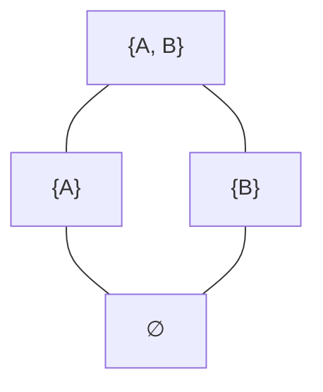

### **Exercise (G 1) Line diagram**

**a) Define: What is a lattice?**
A lattice is a special type of partially ordered set (poset) where any two items have a unique overlapping point (called a "meet") and a unique combined point (called a "join").

**b) Find a preferably small lattice and draw its line diagram.**
Consider a lattice representing the subsets of a two-item group, $\{A, B\}$. 
*   **Top node**: $\{A, B\}$
*   **Middle nodes**: $\{A\}$ and $\{B\}$ (drawn side-by-side below the top)
*   **Bottom node**: $\emptyset$ (the empty set)
Lines connect the top node down to both middle nodes and both middle nodes down to the bottom node. This creates a standard diamond shape.

**c) Which of the following line diagrams (see Figure 1) does not represent a lattice? Why?**

*   **(i)** is **not** a lattice. The two lower-middle nodes share two upper bounds (the two upper-middle nodes). However, they do not have a *unique least* upper bound (a single, specific "join"). 
*   **(v)** is **not** a lattice. It lacks a single, unique top node (a "join" for all elements combined) and a single, unique bottom node (a "meet" for all elements combined).

---

### **Exercise (G 2) Complete lattice**

**a) Define: What is a complete lattice?**
A complete lattice is a lattice that guarantees unique "meet" and "join" points for groups of any size, not just for pairs of items.

**b) Can you find a complete lattice among the lattices of Exercise 1c?**
Yes. Diagrams **(ii)**, **(iii)**, and **(iv)** are complete lattices. A fundamental mathematical rule states that every *finite* lattice (a lattice with a limited, countable number of nodes) is automatically a complete lattice.

**c) Can you give an example of a lattice which is not a complete lattice?**
The set of all integers (whole numbers) ordered by size is a standard example. While any specific pair of numbers has a maximum (join) and a minimum (meet), the entire infinite set lacks a single "highest" number (an ultimate top node) and a single "lowest" number (an ultimate bottom node). Because it cannot cap off the infinite group, it is not complete.

---

### **Exercise (G 3) Formal Concepts**

To find all formal concepts, we first extract the formal context (the cross table) from Figure 2. A formal concept is defined as a perfect pairing between a subset of objects (the extent) and a subset of attributes (the intent). 

**Objects ($G$)**: Tick, Trick, Track, Donald, Daisy, Gustav, Dagobert, Annette, Primus v. Quack.
**Attributes ($M$)**: older, middle, younger, male, female, rich, carefree, indebted.

By checking every possible subset and mathematically finding the shared traits, we compute the following 19 formal concepts:

1.  **Extent**: $\{$Tick, Trick, Track, Donald, Daisy, Gustav, Dagobert, Annette, Primus$\}$ | **Intent**: $\emptyset$ *(Top Concept)*
2.  **Extent**: $\{$Dagobert, Annette, Primus$\}$ | **Intent**: $\{$older$\}$
3.  **Extent**: $\{$Donald, Daisy, Gustav$\}$ | **Intent**: $\{$middle$\}$
4.  **Extent**: $\{$Tick, Trick, Track, Donald, Gustav, Dagobert, Primus$\}$ | **Intent**: $\{$male$\}$
5.  **Extent**: $\{$Tick, Trick, Track, Daisy, Gustav, Annette$\}$ | **Intent**: $\{$carefree$\}$
6.  **Extent**: $\{$Daisy, Annette$\}$ | **Intent**: $\{$female, carefree$\}$
7.  **Extent**: $\{$Donald, Primus$\}$ | **Intent**: $\{$male, indebted$\}$
8.  **Extent**: $\{$Dagobert, Primus$\}$ | **Intent**: $\{$older, male$\}$
9.  **Extent**: $\{$Donald, Gustav$\}$ | **Intent**: $\{$middle, male$\}$
10. **Extent**: $\{$Daisy, Gustav$\}$ | **Intent**: $\{$middle, carefree$\}$
11. **Extent**: $\{$Tick, Trick, Track, Gustav$\}$ | **Intent**: $\{$male, carefree$\}$
12. **Extent**: $\{$Tick, Trick, Track$\}$ | **Intent**: $\{$younger, male, carefree$\}$
13. **Extent**: $\{$Dagobert$\}$ | **Intent**: $\{$older, male, rich$\}$
14. **Extent**: $\{$Annette$\}$ | **Intent**: $\{$older, female, carefree$\}$
15. **Extent**: $\{$Primus$\}$ | **Intent**: $\{$older, male, indebted$\}$
16. **Extent**: $\{$Daisy$\}$ | **Intent**: $\{$middle, female, carefree$\}$
17. **Extent**: $\{$Donald$\}$ | **Intent**: $\{$middle, male, indebted$\}$
18. **Extent**: $\{$Gustav$\}$ | **Intent**: $\{$middle, male, carefree$\}$
19. **Extent**: $\emptyset$ | **Intent**: $\{$older, middle, younger, male, female, rich, carefree, indebted$\}$ *(Bottom Concept)*
