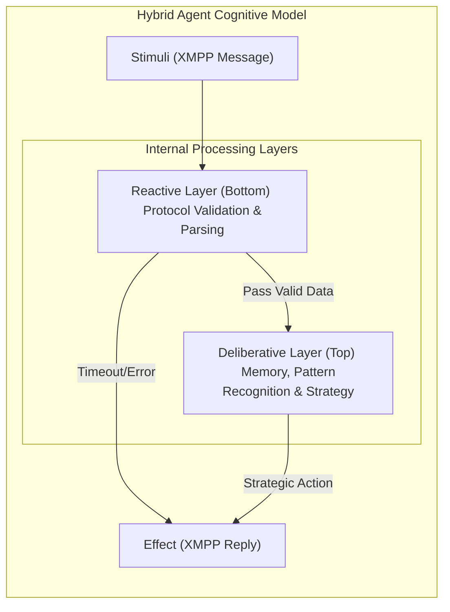
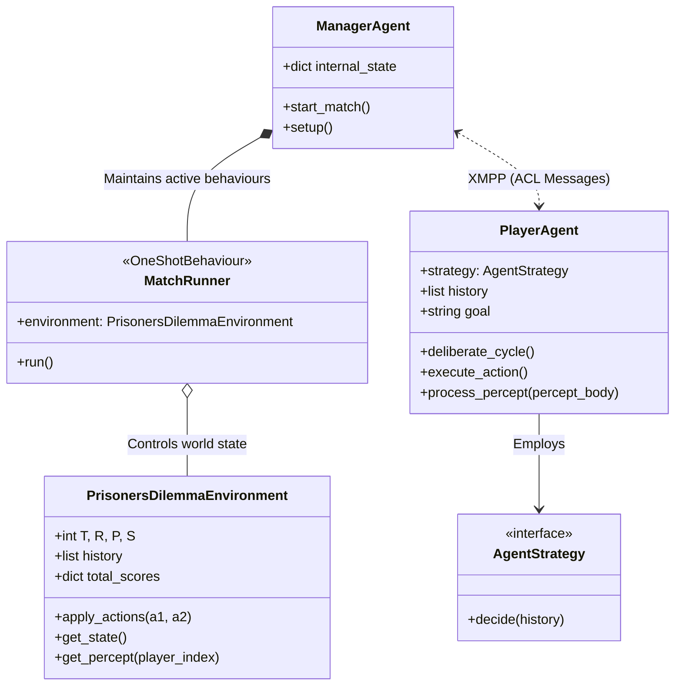
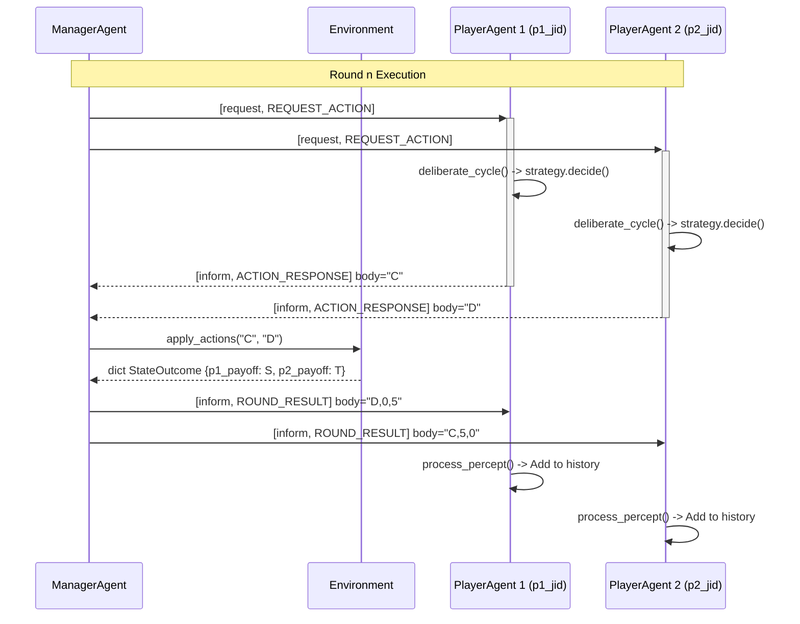
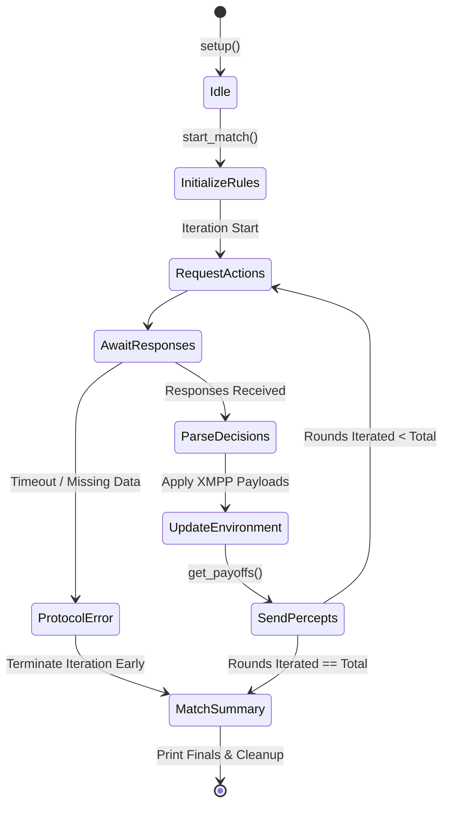

# Multi-Agent System Documentation: Prisoner's Dilemma

> [!NOTE]
> This document details the architectural design and implementation of a Multi-Agent System (MAS) built on the **SPADE (Smart Python Agent Development Environment)** framework to simulate the Iterated Prisoner's Dilemma Game. 
> 
> The system design is explicitly categorized using formal definitions such as the **PAGE(S)** model for Agent-Oriented Design, **PEAS** and **Hybrid Layered Architecture**.

---

## 1. System Overview

The system consists of independent, autonomous agents engaged in a strategic game. Agents operate within a virtual environment representing the interaction space, communicating continuously via an XMPP message passing interface.

### Project Boundaries
- **Agents:** Two competitors `Player Agent` and one coordinator `Manager Agent`;
- **Communication:** Standardized direct messaging asynchronously using **FIPA-ACL** semantics;
- **Goal:** To allow strategic evaluation of different algorithms (Tit-For-Tat, Random, etc.) across repeated simulated rounds.

---

## 2. Environment Design (PEAS & PAGE(S))

The environment acts as the foundation, enforcing interaction constraints and computing state outcomes. It is encapsulated within the `Prisoners Dilemma Environment` subsystem.

### 2.1 PEAS Model Specification

> [!IMPORTANT]
> The PEAS model outlines the interaction space by defining what the agents aim for, what they interface with, how they act and what they observe.

| Component | Formal Implementation |
| :--- | :--- |
| **P**erformance Measure | Cumulative payoff sums calculated from the interaction matrix ($T > R > P > S$). Agents aim to maximize their individual value. |
| **E**nvironment | A discrete, multi-agent virtual arena mediating concurrent interactions between autonomous entities. |
| **A**ctuators | The system's action execution mechanism, translating abstract agent decisions (`C` or `D`) into the environment via XMPP. |
| **S**ensors | The Perception subsystem interpreting the state of the match, identifying round outcomes and the opponent's historical choices. |

### 2.2 Formal Environmental Properties (PAGE(S) Classification)

The total set of states $S$ behaves under the following theoretical properties:

* **Inaccessible & Partially Observable:** Agents cannot view the internal logic or current memory vector of their opponent. They only see the *consequences* of actions;
* **Non-deterministic:** Because multiple independent agents act concurrently, from the perspective of an individual agent, the environment state transition is non-deterministic;
* **Sequential:** Future state configurations and overall payoffs are heavily influenced by the shared history space of all previous interactions;
* **Static:** The state only updates synchronously immediately after all active agents dispatch their actions;
* **Discrete:** The state representations and available actions belong to a strictly finite set $A = \{C, D\}$;
* **Non-Markovian:** The system inherently requires historical memory. Focusing exclusively on the current state (latest round) is insufficient for complex strategy formulation (e.g., detecting a defecting pattern over 10 rounds).

---

## 3. Agent Object-Oriented Design (PAGE Subsystems)

Following the PAGE model, both the `PlayerAgent` and `ManagerAgent` classes define four fundamental elements: **Perception**, **Action**, **Goal** and **Environment**.

### 3.1 Player Agent PAGE Decomposition
*   **Perception ($P$):** Receives environmental/managerial stimuli via two specific ACL ontologies. `REQUEST_ACTION` stimulates a turn and `ROUND_RESULT` updates their internal state;
*   **Action ($A$):** Generates XMPP payloads containing decision representations;
*   **Goal ($G$):** To out-stratagem the opponent and secure the highest total sum according to the chosen `Agent Strategy`;
*   **Environment ($E$):** The manager-provided tournament instance loop.

### 3.2 Manager Agent PAGE Decomposition
*   **Perception ($P$):** Observes the action inputs dispatched by the players;
*   **Action ($A$):** Applies mathematical interactions to the environment and distributes state feedback;
*   **Goal ($G$):** To ensure unbiased synchronization, manage synchronization timeouts and correctly preserve round history in the simulation dataset;
*   **Environment ($E$):** The XMPP server fabric and the environment state container.

---

## 4. Communication & Interaction Modeling

> [!TIP]
> Information flow relies strictly on isolated data packages rather than shared memory spaces. 

### Message Passing Framework
The MAS utilizes asynchronous messaging over the XMPP network. Agents formulate packets mapped to the **ACL (Agent Communication Language)**.

*   **Performatives:** Dictates the intent of a message:
    *   `request`: Manager requesting an action;
    *   `inform`: Player responding with an action or Manager returning scores;
*   **Ontologies:** Groups messages by their contextual sub-domain (e.g., `REQUEST_ACTION`, `ROUND_RESULT`, `ACTION_RESPONSE`).

---

## 5. Architectural Abstract: Hybrid Layered System

The components of the system fuse two common theoretical approaches into a layered methodology: **Reactive** logic for stability and **Deliberative** logic for complexity.

### 5.1 Reactive Layer (Protocol Control)
Handles immediate reflexes. `PlayerAgent` actively listens on the incoming message stream. If a message is malformed or times out, the reactive layer interrupts without needing complex cognitive effort from the agent.

### 5.2 Deliberative Layer (Cognitive Cycle)
For optimal play, it uses the history repository (`history`) to track the environment over time.
1.  **Sense:** Gather the result of the previous round.
2.  **Update State:** Append it to the `history` tracker and adjust the cumulative score variables.
3.  **Deliberate:** Execute the active algorithm class to form a response matrix.
4.  **Execute:** Pass the stringified choice down to the action payload handlers.

---

## 6. Structural & Behavioral Diagrams

### 6.1 Class Hierarchy and Association
This structure highlights the compositional relationship between the coordination engine and the virtual environment.

### 6.2 Round Synchronization Sequence
Traces the lifetime of a single turn execution across all layers.

### 6.3 State Machine: Manager Workflow
Illustrates the Managers internal process for controlling the match state.

