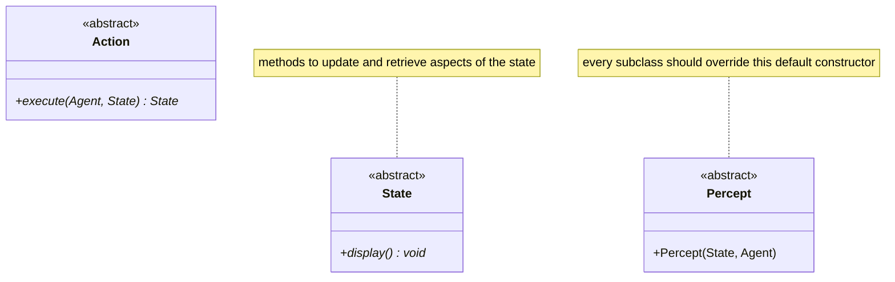
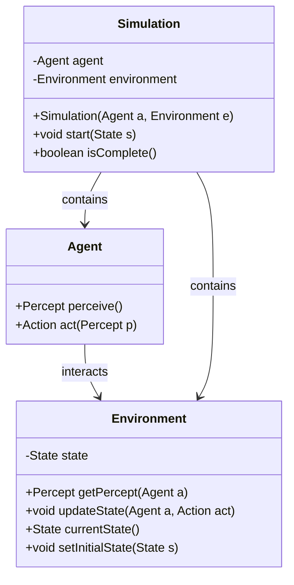

<!-- --------------------------------------------------------------- -->
<!-- -------------------- COURSE 1 INTRODUCTION -------------------- -->
<!-- --------------------------------------------------------------- -->

# 🔖 **Course 1 - Introduction to Multiagent Systems**

## 📖 1 - Introduction
<span style="color:red">🔴**Artificial Intelligence**</span> (_**AI**_) encompasses both symbolic representations, such as logic and expert systems and computational intelligence, which relies on numerical knowledge representations like machine learning and fuzzy systems.
Within this spectrum, the agent paradigm serves as a computational model of human behavior, characterized by autonomy, reactivity, proactivity and communication.
These agents are transforming productivity across diverse fields, evolving from tools that automate repetitive tasks into advanced autonomous systems.
This evolution has led to the rise of **Agentic AI**, where autonomous systems powered by Large Language Models (_**LLM**_) **independently plan, reason and execute complex workflows with minimal human supervision**.

<span style="color:red">🔴**Distributed Artificial Intelligence**</span> (_**DAI**_), established between 1975 and 1980, shifts the focus from centralized, monolithic intelligence to decentralized problem-solving. It removes the requirement for data to reside in a single location.
<span style="color:red">**Multiagent Systems act as the primary paradigm of Distributed Artificial Intelligence**</span>, modeling a society of interacting agents working concurrently.

- ⚙️ Major application domains for artificial intelligence agents include medicine, educational data mining, search-based software engineering, e-business, computer vision and bioinformatics;
- 🤖 Agentic AI distinguishes itself from standard artificial intelligence agents through its focus on complex concurrency, coordination and independent goal execution without direct human triggering/supervision.

## 📖 2 - DAI and agents
Distributed Artificial Intelligence is an interdisciplinary field integrating artificial intelligence, software engineering, sociology, economics and game theory to study and build Multiagent Systems.
🔴 **An agent is a computational entity that perceives its environment through sensors and acts upon it through effectors autonomously**. This abstraction applies universally, whether the agent is a human using sensory organs and muscles, a physical robot utilizing cameras and motors or a software agent processing bit strings to deliver data outputs.


> ### Image: [educba](https://www.educba.com/agents-in-artificial-intelligence/)

Research in Distributed Artificial Intelligence is traditionally divided into two primary directions:
- 🤖 **Multiagent Systems** (_**MAS**_): focus on how independent agents coordinate their knowledge, communicate and reason about their social interactions within a shared environment;
- 📑 **Distributed Problem Solving** (_**DPS**_): divides a specific problem among multiple nodes that share knowledge to accelerate the solution process.
Modern Distributed Problem Solving encompasses distributed planning, search and sophisticated distributed machine learning techniques designed to handle massive datasets and reduce training times.

Agent manifestations based on sensory and actuation mechanisms:
  - _Human agents utilize eyes and ears for sensors and hands or vocal cords for effectors_;
  - _Robotic agents utilize infrared or cameras for sensors and grippers or wheels for effectors_;
  - _Software agents utilize encoded input strings for sensors and computational outputs for effectors_.

Distributed Machine Learning architectures:
  - 🔴 **Data Parallelism** replicates the model across nodes and slices the data across processing units, representing the most widely adopted approach;
  - 🔴 **Model Parallelism** splits a single large model into different independent segments across nodes to accelerate training for complex architectures;
  - 🔴 **Federated Learning** enables multiple entities to collaboratively train a shared model without exchanging their localized raw data.

## 📖 3 - DAI vs AI
The fundamental distinction between traditional **Artificial Intelligence** (_**AI**_) and **Distributed Artificial Intelligence** (_**DAI**_) lies in their perspective on intelligence and interaction. The long-term objective of Distributed Artificial Intelligence is to develop mechanisms that enable seamless interaction among computational entities and humans, addressing the critical challenge of determining when, how and with whom to interact.
While both fields address the computational aspects of intelligence, Distributed Artificial Intelligence serves as a broader generalization of traditional paradigms that shifts focus from the individual to the collective.

- 💾 **Traditional Artificial Intelligence** **concentrates on isolated cognitive processes within individuals**, viewing intelligence as a property of a standalone disconnected system;
- 📚 **Distributed Artificial Intelligence** **focuses on social processes within groups**, treating intelligence as an emergent property of connected systems that actively interact, negotiate and collaborate.


<!-- --------------------------------------------------------------- -->
<!-- -------------------- COURSE 2 APPLICATIONS -------------------- -->
<!-- --------------------------------------------------------------- -->

# 🔖 **Course 2 - Introduction to Multiagent Systems**

## 🤖 1 - Agents
🔴 An **agent** is defined as a **computer system situated within an environment, capable of autonomous action to fulfill its design objectives**.
Agents continuously interact with their surroundings by receiving input through sensors and executing output via effectors or actions.
The fundamental concept underlying agency is 🔴 **autonomy**, **which is the ability of a system to control its internal state and behavior without human intervention**.


> ### Image: Agentic Flow

- 💡 **Key Insight**: _Agents differ from traditional software programs because they operate autonomously and can intelligently delegate tasks_.

## ⚙️ 2 - Characteristics / Properties of agents
An agent’s architecture determines its behavior, mapping perceptions to actions via its internal program. Success is measured externally by a performance metric. Effective agents act autonomously and flexibly, responding to environmental changes while proactively pursuing goal directed behaviors.

- **Reactivity**: The capacity to perceive environmental conditions and respond appropriately to state changes.
- **Pro-activeness**: The ability to exhibit goal-directed behavior by taking initiative rather than strictly reacting to events.
- **Rationality**: The execution of optimal decisions that maximize a specific performance measure based on current knowledge.
- **Social Ability**: The capability to communicate and interact cooperatively with other agents or human users.
- **Key Insight**: Effective agents require a flexible architecture that balances reactive responses with proactive, rational goal execution.

## 🤖 3 - Intelligent agents
🔴 **An intelligent agent extends fundamental agency by incorporating an initial knowledge base and the vital capability of learning**.
This learning capability ensures true autonomy, allowing the agent to deduce and adapt its behavior based on empirical experience rather than relying solely on static, pre-programmed rules. Agents operating exclusively on initial knowledge risk losing flexibility and failing if their environment evolves unexpectedly.

Intelligent agents frequently utilize a utility function, mapping environment states to real numbers to quantify the degree of success.
The agent mathematically prefers and targets states yielding the maximum utility. **Techniques such as reinforcement learning are often employed to iteratively optimize this utility over time through environmental interaction**.

- 💡 **Key Insight**: _The integration of machine learning and utility functions enables agents to maintain autonomy and rationality in dynamic, unpredictable environments_.

## 🕵️‍♂️ 4 - Agent paradigm
The concept of agents operates as a transformative paradigm across both 💻 **Software Engineering** (_**SWE**_) and 🤖 **Artificial Intelligence** (_**AI**_):
- **Software Engineering Paradigm**: Utilizes software agents as a structural abstraction to automate tasks and manage system complexity through delegation;
- **Artificial Intelligence Paradigm**: Utilizes artificial agents as computational models of human intelligence and decision-making within **Distributed Artificial Intelligence** (_**DAI**_);
- 💡 **Key Insight**: Developing agent-based systems requires integrating intelligent decision-making within rigorous, foundational software engineering frameworks.

## 🌐 5 - Application areas
Agent technologies are applied in environments that require flexibility, autonomy and the ability to learn. They may function as single-agent systems with centralized control or as Multiagent Systems designed for decentralized contexts where data, control and expertise are distributed.
🔴 In **Multiagent Systems** (_**MAS**_), learning can occur through centralized training with decentralized execution, where agents learn together but act independently based on local information, or through fully decentralized learning, where each agent learns on its own. While this increases scalability, it can also lead to instability or inconsistent behavior among agents.

- **Single-agent Systems**: Characterized by centralized control and learning execution.
- **Multiagent Systems**: Ideal for domains requiring decentralized control, such as distributed healthcare or industrial process management.
- **Centralized Training / Decentralized Execution**: Agents leverage a shared learning model but operate autonomously in the environment.
- **Fully Decentralized Execution**: Highly scalable models where agents learn and act entirely independently, though susceptible to behavioral instability.
- 💡 **Key Insight**: Multiagent Systems provide essential decentralized architectures for environments where centralized control is either impossible or computationally inefficient.

## 🛠️ 6 - Application domains
Agents are software programs that act like independent workers. They are useful for handling complex tasks, especially when many systems or users are involved.

- **Distributed Systems**: Applications include air traffic control, smart factory automation and internet device cooperation;
- **E-Business and Profiling**: Utilizing clustering and behavioral data mining to segment customers and drive recommender systems;
- **Mobile Agents**: Network-bound entities that migrate between hosts to execute code locally, conserving bandwidth and reducing latency;
- **Human-Computer Interaction**: Intelligent interfaces and personal digital assistants that adapt to user behavior through active observation;
- 💡 **Key Insight**: By operating directly at the data source or adapting to user inputs, agents optimize both network efficiency and human-computer workflows.

## 🤖 7 - Agents vs. existing paradigms
🔴 **Agents differ from traditional software and Object-Oriented constructs by being autonomous, proactive and adaptive**.
Unlike standard procedures or objects, which are passive and dependent on external invocation, agents encapsulate both state and behavior, possess their own continuous control thread and determine how to respond based on internal goals. They are smart active entities capable of reasoning and acting independently in dynamic environments, unlike Expert Systems that rely on user input.

- **Autonomy of Behavior**: Agents control the execution of their own methods, whereas standard objects are controlled by the invoking entity.
- **Active Execution**: Agents maintain persistent threads of control, enabling continuous environmental interaction compared to passive objects.
- **Environmental Situation**: Unlike traditional Expert Systems, agents are actively situated in and act upon an external environment rather than acting merely as static advisory databases.
- 💡 **Key Insight**: Agents elevate traditional object-oriented and symbolic artificial intelligence models by integrating state encapsulation with independent, active decision-making.

## 💻 8 - Comparison of two software paradigms
🔴 **Conventional software is hierarchical, centralized and data-driven, executing pre-programmed behaviors for predictable outcomes**.
🔴 **Multiagent Systems (_MAS_), (inspired by biological swarms) are decentralized and knowledge-driven, with numerous small agents interacting to produce complex, emergent behavior**.

- **Conventional Software**: Relies on centralized hierarchies, data-driven logic, and rigid, pre-programmed behaviors.
- **Multiagent Software**: Utilizes distributed networks, knowledge-driven operations, and generates emergent system behaviors.
- **Swarm Intelligence**: Employs parallel, specialized agents to collaboratively solve complex tasks without centralized leadership.
- 💡 **Key Insight**: Multiagent paradigms shift system design from rigid, top-down control to flexible, decentralized networks capable of emergent problem-solving.


> ### Image: Comparison of two software paradigms

## 🖥️ 9 - Agent oriented software engineering (AOSE)
**Agent-Oriented Software Engineering** (_**AOSE**_) provides methodologies to model, design and build complex systems by decomposing them into autonomous agents, abstracting system architectures and organizing agents like human organizations. In AOSE, system components correspond to agent organizations and individuals, with explicit interaction mechanisms enabling cooperation, coordination, and conflict resolution to achieve system goals.

- **Decomposition**: Structuring software into decentralized components featuring persistent, independent threads of control.
- **Abstraction**: Leveraging the agent paradigm to simplify the conceptualization and visualization of complex systems.
- **Organization**: Establishing formal structures and relationships among agents to manage complex workflows.
- **Interaction** Mechanisms: Utilizing communication and negotiation protocols rather than basic programmatic calls to manage subsystem relationships.
- 💡 **Key Insight**: Agent-Oriented Software Engineering provides the necessary abstraction and organizational frameworks to engineer complex systems as collaborative societies of autonomous software entities.


<!-- --------------------------------------------------------------- -->
<!-- -------------------- COURSE 3 AGENT DESIGN -------------------- -->
<!-- --------------------------------------------------------------- -->

# 🔖 Course 3 - Agent Design, Environments and Architectures

## 📖 3.1 - Methodologies for agent-based systems development
The development of agent-based systems can leverage both classical **Software Engineering** methodologies and specialized **Agent-Oriented** approaches.
Classical software engineering relies on sequential processes, such as the **Waterfall Model** and **Model-Driven Development** (_**MDD**_), as well as iterative Agile frameworks like **Test-Driven Development** (_**TDD**_) and **Behavior-Driven Development** (_**BDD**_).

- **Classical Methodologies**: Includes sequential Waterfall projects, Agile MDD, and iterative testing frameworks like TDD and BDD;
- **Agent-Oriented Methodologies**: Includes Gaia, which focuses heavily on organizational abstraction, and Multiagent Software Engineering (MaSE).

## 📖 3.2 - Agent-based development lifecycle
In a sequential agent-based lifecycle, the specification phase defines system inputs, outputs, agent types and communication protocols using languages like **Cognitive Agent Specification Language** (_**CASL**_) and **AgentSpeak**. The design phase employs **Agent Unified Modelling Language** (_**AUML**_) developed by _**FIPA**_ to model agent architectures, communication networks (via **Agent Communication Language** (_**ACL**_)) and coordination strategies.
Implementation follows the **Agent-Oriented Programming** (_**AOP**_) paradigm, defining agents by their capabilities, initial beliefs and commitments.

Lifecycle Stages:
- **Specification**: Utilizes formal languages like CASL, AgentSpeak and SLABS to define agent inputs, outputs and tasks;
- **Design**: Involves conceptual modeling with Agent Unified Modeling Language (AUML) and defining communications using FIPA's Agent Communication Language (ACL);
- **Implementation**: Employs Agent-Oriented Programming (AOP) principles, concurrent logic or multiparadigm languages (such as Java or Python) through frameworks like JADE and SPADE;
- **Testing**: Includes both unit and automated testing protocols to ensure system reliability.
- 💡 **Key Insight**: The agent-based lifecycle mirrors traditional software engineering but requires specialized modeling languages (AUML) and execution frameworks to handle autonomous behaviors and agent communication.

## 📖 3.3 - Agent design PAGE
🔴 The conceptual design of an agent requires a clear abstraction of its operational parameters, most commonly represented by the **PAGE** model, which stands for **Perception, Action, Goal and Environment**. Conceptually, the environment represents the total set of possible environment states, often expanded to **PAGE(S)** that **include this state configuration**.

🔴 **PAGE Model Components**:
- **Perception**: The inputs the agent receives, such as a sensor detecting dirt or a camera interpreting pixels;
- **Action**: The capabilities of the agent, such as turning, moving, or printing categorizations;
- **Goal**: The objective the agent is designed to achieve, such as minimizing power, maximizing purity, or finding a person's email address;
- **Environment**: The external conditions, such as a grid room, a refinery, or the Internet, including its current state.


> ### Image: _Sample of agents in different types of applications_

## 📖 3.4 - Environment
An agent’s environment—physical or virtual—defines its interaction boundaries and influences system complexity.
Agent-environment interactions can be specified using the **PEAS** model: **Performance measure, Environment, Actuators and Sensors**.
Environments are further classified mathematically across divisions/areas that shape agent reasoning and behavior.

Key Environmental Properties:
- **Accessible vs. Inaccessible**: An accessible environment provides complete, accurate, and up-to-date state information, making agent design simpler; most real-world environments are inaccessible;
- **Deterministic vs. Non-deterministic**: In deterministic settings, actions have guaranteed outcomes, whereas non-deterministic settings require probability distributions to account for stochastic uncertainty;
- **Episodic vs. Sequential (Non-episodic)**: In episodic settings, an agent's performance depends only on discrete, isolated events; in sequential settings, current actions have long-term consequences requiring planning;
- **Static vs. Dynamic**: Static environments only change when the agent acts, while dynamic environments feature independent external processes that change conditions beyond the agent's control;
- **Discrete vs. Continuous**: Defines whether the environment contains a finite, fixed number of actions and percepts or a continuous spectrum;
- **Markovian vs. Non-Markovian**: A Markovian environment follows the Markov property, where future state predictions depend solely on the current state and action, independent of historical data.

## 📖 3.5 - Abstract architectures for agents
Abstract architectures formalize the mathematical view of agents interacting with environment states. An environment exists as a set of states ($S=\{s_{1},s_{2},...\}$), and the agent possesses a set of actions ($A=\{a_{1},a_{2},...\}$). Abstractly, an agent is a function that maps a sequence of environment states to a specific action. The environment's behavior is non-deterministic, modeled as a function mapping the current state and action to a set of possible resulting states. This continuous interaction forms a characteristic behavior represented as a sequence or history of states and actions over time.

Architectural Variations:
- **Purely Reactive Agents**: Base actions strictly on the current state with no internal history. An example is a thermostat turning a heater on or off based solely on the current temperature;
- **State-Based Agents**: Maintain an internal memory state to process interactions.
- **Execution Cycle (State-Based)**: The agent observes the environment to generate a percept, updates its internal state based on that percept, selects an action derived from the new state, and executes the action before repeating the cycle.


<!-- --------------------------------------------------------------- -->
<!-- ------------------- COURSE 4 ARCHITECTURES -------------------- -->
<!-- --------------------------------------------------------------- -->

# 🔖 Course 4 - Architectures for Agents

## 📖 4.1 - Concrete Architectures for Agents

Concrete architectures define the practical methodologies used to construct autonomous agents, translating abstract agent models into implementable systems:
- 🔴 **Abstract Architecture**: **abstract/formal view of agents and their interaction with the environment**;
- 🔴 **Concrete Architecture**: **concrete architectures focus on decomposition into modular components**, the interaction between these modules and the implementation of decision-making mechanisms. These architectures are broadly categorized into three types:
  - **Reactive**: fast reactions/responses to changes detected in the environment;
  - **Deliberative**: focused on long term planning of actions, centered on a set of basic
goals;
  - **Hybrid**: a combination between reactive and a deliberative.

## 📑 4.1.1 - Reactive architecture

🔴 **Reactive architecture emphasize immediate responsiveness to environmental stimuli**. Main characteristics:
- operate without maintaining historical context, planning capabilities or complex internal states;
- decision-making is achieved through direct mappings from perceived situations to actions.

**Advantages**: This simplicity allows for **fast execution and low computational overhead**, making reactive agents suitable for dynamic environments such as video games or obstacle-avoiding robots.

**Disadvantages**: their lack of memory and learning capabilities limits their adaptability and long-term optimization.


> ### Image: Reactive architecture agent representation

## 📑 4.1.2 - Deliberative architecture 

🔴 **Deliberative architecture incorporate internal representations of the environment and rely on planning mechanisms**. Main characteristics:
- agents maintain state, remember past interactions and predict future outcomes through structured reasoning processes;
- planning in such systems involves searching through possible states and actions using predictive models.


> ### Image: Deliberative architecture agent representation

Problems addressed by planning can be categorized as:
- Ignorable: steps can be skipped;
- Recoverable: steps can be reversed;
- Irrecoverable: decisions are final.

**Deliberative agents may operate in offline mode when the environment is known** or **online mode in uncertain environments**, requiring adaptive replanning and learning techniques such as reinforcement learning.

## 📑 4.1.3 - Hybrid architecture

🔴 Hybrid architecture aim to **integrate the strengths of both reactive and deliberative approaches**.
They combine fast responsiveness with strategic planning by structuring agents into layered systems.
In horizontal layering, each layer independently connects to both input and output, enabling parallel behavior generation. In vertical layering, processing flows sequentially through layers, though this introduces potential fault tolerance issues. Hybrid systems are particularly effective in complex environments where both immediate reactions and long-term reasoning are required.


> ### Image: Hybrid architecture agent representation

## 📑 4.1.4 - Logic-based architecture

🔴 **Logic-based architectures rely on symbolic representations and formal logic to drive decision-making**.
Main characteristics:
- can be deliberative or hybrid;
- the syntactic manipulation corresponds to logical deduction or theorem proving;
- their computational complexity often limits real-time applicability;
- systems typically lack inherent learning capabilities, although extensions like Inductive Logic Programming (ILP) introduce supervised rule learning.

## 📑 4.1.5 - Belief-desire intention (BDI) architecture
🔴 The _BDI_ architecture **models human practical reasoning** by structuring agent cognition into three components:
- **Beliefs**: information about the world;
- **Desires**: objectives to achieve;
- **Intentions**: committed plans of action.

Decision-making is split into deliberation (selecting goals) and means-ends reasoning (determining how to achieve them). 🔴 **This framework provides an intuitive and modular approach to agent design and is widely used in applications requiring human-like reasoning**.


> ### Image: Belief-desire intention (BDI) architecture agent representation

## 📖 4.2 - Agent Programming Languages

**Agent-oriented programming** (_**AOP**_) represents a paradigm shift introduced to directly encode agent behavior using high-level mentalistic constructs such as beliefs, desires and intentions.
🔴 **AOP abstracts away low-level implementation details, focusing instead on specifying “what” the agent should achieve rather than “how” to achieve it**. This positions AOP as a post-declarative paradigm that **extends object-oriented programming principles**.

Several specialized programming languages and frameworks support agent-oriented development:
- **AGENT0**, one of the earliest AOP languages, uses a Lisp-like syntax to define agent behavior;
- **AgentSpeak**, adopts a Prolog-like syntax and directly implements the BDI architecture, enabling structured reasoning and planning. Extensions such as **AgentSpeak(PL)** incorporate probabilistic reasoning through Bayesian networks, enhancing decision-making under uncertainty. The Jason framework serves as an interpreter for extended AgentSpeak, facilitating practical deployment;
- **Concurrent MetateM** represents another approach, where logical specifications are directly executed as programs. This enables agents to operate based on time-dependent logical constraints.


<!-- --------------------------------------------------------------- -->
<!-- ------------------ COURSE 5 CHARACTERISTICS ------------------- -->
<!-- --------------------------------------------------------------- -->

# 🔖 **Course 5 - Multiagent Systems Characteristics**

## 📖 5.1 - Multiagent Systems

A 🔴 **Multiagent System** (_**MAS**_) **is a network of separate computer programs called agents**.
**These agents connect and interact with one another**. A MAS spreads out computer power and skills across this network. A MAS is 🔴 **decentralized**, meaning no single central computer is in control.
🔴 **The agents must be able to work together**. To do this successfully, agents must **cooperate**, **coordinate** and **negotiate**, just like people do.

### 📑 5.1.1 MAS Challanges

Multiagent systems (MAS) revolve around three core challenges: **communication**, **collaboration** and **coordination**. Agents must exchange knowledge, intentions, and beliefs, collaborate through negotiation (often among self-interested entities) and ensure coordinated, controlled behavior within a shared environment.

🔴 **Collaborative agents are designed to operate autonomously** while cooperating to fulfill user-defined tasks. They are capable of rational decision-making and may incorporate learning mechanisms to improve performance over time.


> ### Image: Collaborative Agents

Effective **inter-agent cooperation** is achieved through structured mechanisms such as grouping, communication, specialization, resource and task sharing, coordinated actions, and conflict resolution via arbitration or negotiation. These mechanisms enable agents to function collectively despite differing objectives.

### 📑 5.1.2 MAS Organizations

🔴 **MAS organizations define how agents are structured and interact**. They are composed of agent classes assigned specific roles and connected through relationships such as acquaintance, subordination and conflict.

Organizational design can follow multiple approaches:
- **Horizontal Modular Design**: components are functionally separated (e.g., [Prodigy](https://www.researchgate.net/publication/234783121_PRODIGY_An_integrated_architecture_for_planning_and_learning), [ICARUS](http://citeseerx.ist.psu.edu/viewdoc/download?doi=10.1.1.295.9054&rep=rep1&type=pdf));
- **Hierarchical Vertical Structures**: Bio-inspired models such as ant colonies or immune systems, often leveraging simple interaction rules and reinforcement learning.

At a higher level, MAS adopt organizational paradigms like hierarchies, holarchies, teams, coalitions and markets to model complex systems. Frameworks such as [MOISE](https://moise.sourceforge.net/) support organization-oriented programming, emphasizing role-based design where entities, roles, and activities are clearly defined.

### 📑 5.1.3 MAS Design

🔴 **MAS design involves two fundamental problems**:
- **Agent design** (**micro level**): building autonomous agents capable of independent action;
- **Society design** (**macro level**): enabling effective interaction through cooperation, coordination and negotiation.

## 📖 5.2 - MAS Characteristics

🔴 **A Multiagent System relies on a robust computational infrastructure to enable autonomous-distributed agents to interact**. Agents operate based on explicit knowledge and use specific protocols to communicate, cooperate, or negotiate to achieve individual or system-wide goals. Communication within these systems generally falls into two architectures: indirect communication via Blackboard Systems or Direct Message Passing using standardized agent languages.

### 📑 5.2.1 MAS Environment Characteristics

The MAS environment provides the necessary foundation for agents to function and interact:
- **Infrastructure:** It specifies and provides the communication and interaction protocols;
- **Protocols:**
    - **Communication Protocols:** Allow agents to exchange and understand basic messages (e.g., _proposing_, _accepting_, or _rejecting_ an action);
    - **Interaction Protocols:** Enable agents to string messages together into meaningful conversations;
* **Agent Nature:** The environment is populated by distributed and autonomous agents, which can be either self-interested or cooperative.

### 📑 5.2.2 The Agent Profile

Fundamentally, an agent is an active object that can **reason**, **perceive** and **act**:
- **Knowledge & Reasoning:** Agents possess explicitly represented knowledge and the internal mechanisms to operate on it and draw inferences;
- **Communication as Action:**
  - _Perception_ includes receiving messages;
  - _Action_ includes sending messages.

### 📑 5.2.3 Coordination, Cooperation and Negotiation

Agents communicate primarily to better achieve their own goals or the goals of the broader system:
* **Coordination:** A general property of a system where agents perform activities in a shared environment;
* **Cooperation:** Coordination specifically between _non-antagonistic_ (friendly/aligned) agents;
* **Negotiation:** Coordination specifically among _competitive_ or _self-interested_ agents.


> ##### Image: A taxonomy of coordination

### 📑 5.2.4 Communication Options in MAS

Agents need structured ways to share information, there area two main known approaches:

#### 🔴 **Blackboard Systems**

A shared memory or data repository where agents interact _indirectly_. The blackboard holds data, problem states, requests for help, intermediate results and current agent tasks.

* **Advanced Features:** Uses a "moderator" or "dispatcher" agent. Agents register with the dispatcher, which notifies them of relevant changes so they don't have to constantly check the blackboard themselves;
* **Pros:** Highly flexible mechanism, allows for the use of multiple ($n$) blackboards;
* **Cons:** Centralized structure creates a single point of failure and a potential bottleneck, as everyone must read/write to the same place.


> ##### Image: Blackboard Communication

#### 🔴 **Direct Message Communication**

Agents communicate directly using specialized **Agent Communication Languages** (_ACLs_).

* **FIPA-ACL**: Developed by FIPA and implemented in the JADE framework. Uses specific communication protocols, message components and "performatives";
* **Knowledge Query and Manipulation Language (KQML)**: **Knowledge Query and Manipulation Language**. A protocol for exchanging information between agents and applications, utilizing Lisp-like performatives;
* **Knowledge Interchange Format (KIF)**: A logic language used to describe things declaratively within expert systems. It acts as a means for encoding knowledge, functioning as a prefix version of first-order logic extended to handle nonmonotonic reasoning.


> ##### Image: Direct Message Communication

## 📖 5.3 - A Dynamic MAS

🔴 **A MAS is considered dynamic when it changes over time**. A dynamic MAS model relies on a few key assumptions. It usually consists of two or more agents ($n \ge 2$). The environment operates with strict, predictable rules and the agents act non-cooperatively, meaning each agent only pursues its own selfish objectives. The system starts at a time of zero and moves forward in steps until a specific stopping condition is met. At the end, the agents look at the final state of the system to evaluate their success.

This dynamic system is formally described using a mathematical tuple: $<S, \mathcal{A}, h, U>$.
- $S$ represents the joint state space, which is the combined situation of all agents;
- $\mathcal{A}$ represents the joint action space, which includes all the possible moves the agents can make;
- $h$ represents the transition function, which calculates how the state changes when agents take action;
- $U$ represents a vector of utility functions, which measure how beneficial the outcome is for each respective agent.

The process works in a loop. At each time step ($t$), the agents observe the current state ($s_t$). Next, each agent chooses an action ($a_t^i$). The entire system then evolves into a new state based on those combined actions ($s_{t+1} = h(s_t, a_t)$). When the state changes, an agent's utility might improve. This measurable improvement is defined as a reward ($r_t^i$). Ultimately, an agent's goal is to maximize the utility of its final state, which is the exact same as maximizing the total sum of all the rewards it receives over time.

<!-- --------------------------------------------------------------- -->
<!-- ------------------------ COURSE 6 AGENT ----------------------- -->
<!-- --------------------------------------------------------------- -->

# 🔖 **Course 6 - Agent Strategy and Design**

## 📖 6.1 - Agent Strategy

An 🔴 **Agent Strategy** is a mapping that decides which action to take based on a **Percept Sequence** (the complete history of everything the agent has perceived):
* **Performance Measure (PM):** An objective metric used to judge the success of an agent's behavior (e.g., amount of dirt cleaned, energy used);
* **Rationality:** An **Ideal Rational Agent** selects the action expected to maximize its PM based on its percept history and built-in knowledge.

---

## 📖 6.2 - Agent Function Implementation

Agents are categorized by their complexity, moving from **Reactive** (responding to the present) to **Deliberative** (thinking about the future).

### 📑 6.2.1 Table-Driven Agent (Reactive)
* **Definition:** Uses a lookup table containing a specific action for every possible percept sequence;
* **Drawbacks:** Tables become impossibly large (e.g., Chess has $35^{100}$ entries); no autonomy or adaptability;
* **Optimization:** Tables can be avoided using **Markov Environments** (where only the current state matters) or by dynamically computing actions.


> ##### Image: Table-Driven Agent Sample

### 📑 6.2.2 Simple Reflex Agent (Reactive)
* **Definition:** Acts based only on the current percept, ignoring history;
* **Condition-Action Rules:** Written as "If [condition] then [action]" (if car-in-front-is-braking then initiate-braking);
* **Limitation:** Only works if the environment is **Fully Observable** (the agent can see everything it needs at that moment).


> ##### Image: Simple Reflex Agent Sample

### 📑 6.2.3 Model-Based Reflex Agent (Reactive)
* **Definition:** Maintains an **Internal State** (a "model" of the world) to track aspects of the environment that cannot be seen currently;
* **Purpose:** Handles **Partially Observable** environments by remembering the past;
* **Technical Tool:** Often implemented using **Finite-State Machines (FSM)**, where the agent transitions between a finite number of states based on inputs.

_Note_: 🔴 A **Finite-State Machine** (**FSM**), also called a **Finite-State Automaton**, is a conceptual model used to design step-by-step logic. It behaves very much like a model-based reflex agent because it keeps track of its current situation to decide what to do next. The FSM looks at its current State and the new Input. It then follows a set rule to perform a Transition to a new state. This process often triggers a specific action in the real world.

Core definitions:
* **State**: A specific condition the machine is in. An FSM can only be in exactly one state at any given time, chosen from a limited (finite) list of options;
* **Input**: A signal, event, or piece of data received from the outside world;
* **Transition**: The act of changing from one state to another state. This change is always triggered by a specific input.

_Brief Example_: Think of a standard traffic light.
* _States_: The system can only be in one of three states: Green, Yellow, or Red;
* _Input_: A built-in timer counts down to zero;
* _Transition_: If the current state is Green, and the timer input reaches zero, the FSM transitions to the Yellow state.


> ##### Image: Model-Based Reflex Agent Sample

### 📑 6.2.4 Goal-Based Agent (Deliberative)
* **Definition:** Acts to achieve specific **Goals** (descriptions of desirable situations);
* **Methodology:** Uses **Search and Planning** to predict how actions will affect the future;
* **Benefit:** More flexible than reflex agents; if the goal changes (e.g., a new destination), the agent adapts without needing new rules.


> ##### Image: Goal-Based Agent Sample

### 📑 6.2.5 Utility-Based Agent (Deliberative)
* **Definition:** Uses a **Utility Function** to map a state to a real number representing "happiness" or desirability;
* **Methodology:** Uses **Decision Theory** to choose actions that maximize *expected* utility;
* **Distinction:** While a goal-based agent only cares about *reaching* the destination, a utility-based agent cares about the *quality* of the path (e.g., speed, safety, comfort).


> ##### Image: Utility-Based Agent Sample

### 📑 6.2.6 Learning Agent
* **Definition:** An agent capable of improving its performance over time;
* **Components:** Includes a **Learning Element** (to make improvements), a **Critic** (to provide feedback) and a **Performance Element** (to select actions).


> ##### Image: Learning Agent Sample

---

### 📖 6.3 Agent-Based Systems Design

**Multi-Agent System (MAS) Design** focuses on how multiple intelligent entities interact with their environment and each other.

**Core Concepts:**
* **Concurrent Execution:** Agents must operate in parallel. Each agent requires its own independent thread of control. The processes of perceiving the environment and deciding on actions happen simultaneously for all agents, not sequentially;
* **Agent Program:** The specific logic an agent uses to map a received percept to a chosen action. This program determines the complexity of the agent (ranging from simple reactive responses to complex deliberative planning);
* **Internal Memory:** Agents can maintain a static memory model of the current environment state. This memory is updated dynamically as new percepts are received or actions are performed;
* **Extended Components:** **Learning Agents** require components beyond the standard action-selection program. These include a learning element, a critic and a problem generator;
* **Performance Evaluation:** Simulators can track an objective score conceptually outside the agent to evaluate its success over time.

**System Simulation Implementations:**

```python
class MultiAgentSimulator:
    """
    Provides simulation environments for multi-agent systems.
    """

    def run_simulation(self, initial_state, update_fn, agents, termination_condition):
        """
        Executes a basic multi-agent simulation loop.
        Agents process percepts and determine actions concurrently.
        The environment state updates based on the collective actions.
        """
        state = initial_state
        
        while not termination_condition(state):
            percepts = {}
            for agent in agents:
                percepts[agent] = agent.get_percept(state)
                
            actions = {}
            for agent in agents:
                actions[agent] = agent.program(percepts[agent])
                
            state = update_fn(actions, agents, state)

    def run_eval_simulation(self, initial_state, update_fn, agents, termination_condition, performance_fn):
        """
        Executes a multi-agent simulation loop that includes continuous performance tracking.
        Returns the final evaluated scores for all agents upon termination.
        """
        state = initial_state
        scores = {agent: 0 for agent in agents}
        
        while not termination_condition(state):
            percepts = {}
            for agent in agents:
                percepts[agent] = agent.get_percept(state)
                
            actions = {}
            for agent in agents:
                actions[agent] = agent.program(percepts[agent])
                
            state = update_fn(actions, agents, state)
            scores = performance_fn(scores, agents, state)
            
        return scores
```

---

### 📖 6.4 Object-Oriented (OO) Design: PAGE(S)
When designing agents as objects, the primary components are:
* **Agent:** The entity selecting actions;
* **Environment:** The external world the agent lives in;
* **State:** The current configuration of the environment;
* **Percept:** The specific data the agent receives from the state;
* **Action:** The output/movement the agent performs.

### 📑 6.4.1 Communication Models
1.  🔴 **Blackboard:** A shared data repository where agents read and write information indirectly;
2.  🔴 **Message Passing:** Agents send direct messages to one another, often using **ACL (Agent Communication Language)**.
 
### 📑 6.4.1 Development Steps
1.  **Define the Model:** Identify agent types, roles and knowledge rules (**Ontology**);
2.  **Select Framework:** Choose a platform (like **JADE for Java** or **SPADE for Pyhton**);
3.  **Implement:** Build the agents, their communication protocols, and the solution logic.





---

<!-- --------------------------------------------------------------- -->
<!-- ------------------------ COURSE 7 aaa ----------------------- -->
<!-- --------------------------------------------------------------- -->

# 🔖 **Course 7 - aaa**

## 📖 7.1 - aaa

Aaa
